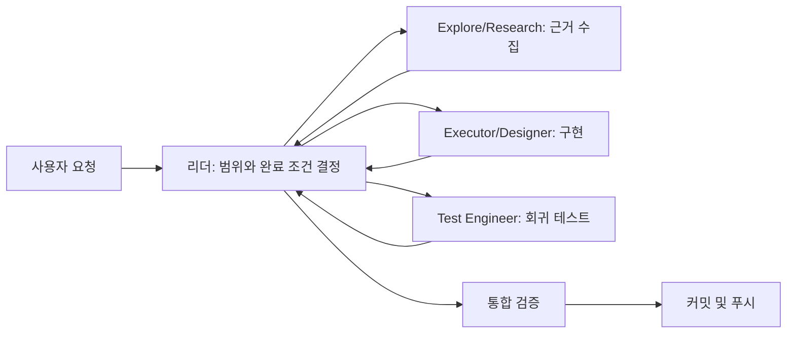

# Codex 에이전트 팀 운영

InvestLens는 루트의 [`AGENTS.md`](../AGENTS.md)를 기준으로 Codex와 OMX 에이전트를 운영합니다. 에이전트 수를 항상 최대로 사용하는 대신, 작업을 빠르고 안전하게 끝낼 수 있을 때만 역할을 분리합니다.

## 기본 운영 모델



### 효율 우선 규칙

- 한두 파일의 변경은 리더가 직접 처리합니다.
- 독립적인 조사와 구현만 병렬로 실행합니다.
- 편집 에이전트는 최대 2명이며 파일 소유권을 겹치지 않습니다.
- 조사 에이전트가 끝나면 해당 슬롯을 검증 에이전트에 재사용합니다.
- 리더만 공유 설정 통합, 최종 검증, Git 작업을 수행합니다.
- 전역에 설치된 `~/.codex/agents` 역할을 재사용하고 프로젝트에 중복 역할 파일을 만들지 않습니다.

## InvestLens 권장 분배

| 작업 유형 | 1차 역할 | 보조 역할 | 최종 게이트 |
|---|---|---|---|
| Swagger/API 연동 | `researcher` + `executor` | `test-engineer` | API 테스트, lint, typecheck, build |
| 화면/반응형 개선 | `designer` | `test-engineer` | 접근성, 다크 모드, 반응형 검증 |
| 인증/401 문제 | `debugger` + `executor` | `test-engineer` | 토큰 제거와 이동 동작 검증 |
| 차트/뉴스 데이터 문제 | `explore` + `debugger` | `executor` | 변환 테스트와 빈 데이터 검증 |
| Cloudflare 배포 변경 | `researcher` + `executor` | `verifier` | `cf-typegen`, Cloudflare build |
| 문서 변경 | 리더 또는 `writer` | 없음 | 링크와 명령 정확성 확인 |

## 자동화 범위

에이전트 팀은 저장소 분석, 구현, 테스트, 빌드, 문서화, 커밋과 푸시를 자동으로 수행합니다. 다만 로그인·MFA·운영 비밀값 입력이나 되돌릴 수 없는 운영 작업처럼 외부 권한 또는 명시적 승인이 필요한 단계는 자동화 범위에서 제외됩니다.

## 작업 요청 예시

팀 구성은 요청 문장에 고정할 필요가 없습니다. 목표만 전달하면 리더가 규모와 파일 경계를 판단해 필요한 역할만 선택합니다.

```text
Swagger 기준으로 종목 알림 기능을 연동하고 테스트와 빌드까지 끝내줘.
```

복잡한 작업에서 병렬 실행을 명시하고 싶다면 다음처럼 요청할 수 있습니다.

```text
에이전트 팀으로 API, UI, 테스트를 독립 작업으로 나눠서 구현하고 검증 후 커밋·푸시해줘.
```
