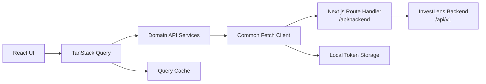

# InvestLens 프론트엔드 개발 문서

## 1. 개발 목표

InvestLens 프론트엔드는 백엔드 OpenAPI 명세를 단일 기준으로 삼아 인증, 종목, 포트폴리오, 뉴스 기능을 실제 API와 연결한 Next.js 애플리케이션입니다.

개발 과정에서는 다음 원칙을 우선했습니다.

- API 경로와 DTO를 추측하지 않고 Swagger 명세를 기준으로 구현
- 공통 API 계층에서 인증, 오류, timeout, 재시도 정책을 일관되게 처리
- 서버 상태와 mutation 상태를 분리해 중복 요청과 불필요한 fetch를 방지
- 기능 화면뿐 아니라 로딩, 오류, 빈 데이터, 인증 만료 상태까지 완성
- 데스크톱 정보 밀도와 모바일 사용성을 함께 확보
- 작은 컴포넌트와 도메인별 모듈로 유지보수 가능성 확보

## 2. 기술 스택

| 구분 | 기술 | 사용 목적 |
|---|---|---|
| 프레임워크 | Next.js 16 App Router | 라우팅, 레이아웃, Route Handler, production build |
| UI | React 19, TypeScript | 컴포넌트와 정적 타입 |
| 스타일 | Tailwind CSS 4 | 반응형 UI와 디자인 토큰 기반 스타일 |
| 서버 상태 | TanStack Query 5 | 캐시, 요청 상태, mutation, 무효화 |
| 차트 | TradingView Lightweight Charts 5 | 가격 영역 차트와 거래량 히스토그램 |
| 아이콘 | Lucide React | 일관된 상태 및 내비게이션 아이콘 |
| 테스트 | Vitest, React Testing Library | API 정책, 데이터 변환, 컴포넌트 동작 검증 |
| 정적 분석 | ESLint, TypeScript | 코드 품질과 타입 안정성 검증 |

## 3. 프로젝트 구조

```text
.
├── docs/                       # 서비스 및 개발 문서
├── src/
│   ├── app/
│   │   ├── (auth)/             # 로그인, 회원가입
│   │   ├── (app)/              # 인증 후 사용하는 서비스 화면
│   │   ├── api/backend/        # 백엔드 same-origin 프록시
│   │   ├── error.tsx           # 전역 오류 화면
│   │   ├── loading.tsx         # 전역 로딩 화면
│   │   └── not-found.tsx       # 404 화면
│   ├── components/
│   │   ├── auth/               # 인증 폼
│   │   ├── layout/             # 헤더, 사이드바, 사용자 메뉴
│   │   ├── providers/          # 인증, 테마, Query Provider
│   │   └── ui/                 # 버튼, skeleton, 상태 화면
│   ├── hooks/                  # debounce 등 범용 훅
│   └── lib/
│       ├── api/                # DTO, 클라이언트, API 서비스, 프록시 정책
│       ├── auth/               # Access Token 저장소
│       ├── chart-data.ts       # 차트 데이터 변환
│       ├── format.ts           # 표시 형식
│       └── query-keys.ts       # Query Key 팩토리
├── package.json
└── vitest.config.mts
```

## 4. 화면과 라우팅

| 경로 | 역할 |
|---|---|
| `/login` | 로그인 |
| `/signup` | 회원가입 |
| `/dashboard` | 포트폴리오 요약과 맞춤 뉴스 |
| `/search` | 한국·미국 주식 및 ETF 검색 |
| `/portfolio` | 관심 종목 조회 및 삭제 |
| `/instruments/[instrumentId]` | 종목 정보, 가격 차트, 포트폴리오 관리, 관련 뉴스 |
| `/news/[newsId]` | 뉴스 본문, 시장 맥락, 종목별 영향 분석 |

루트 경로 `/`는 `/dashboard`로 이동합니다. 인증 화면과 서비스 화면은 Route Group으로 레이아웃을 분리해 각 영역의 구조와 책임을 명확히 했습니다.

종목 상세의 관련 뉴스 영역은 기사 목록과 별도로 `/instruments/{instrumentId}/news/sentiment`를 조회합니다. AI 분석 완료 기사들의 상승·하락·중립 가능성 평균을 분할 막대로 표시하며, `aiAnalyzed=false`일 때 반환되는 0은 실제 0%로 노출하지 않고 분석 준비 상태로 구분합니다. 기사별 확률도 동일하게 `aiAnalyzed=true`인 영향 평가에만 표시합니다.

## 5. 전체 아키텍처



### 요청 흐름

1. 화면 컴포넌트가 TanStack Query를 통해 도메인 API 함수를 호출합니다.
2. `services.ts`가 DTO에 맞는 경로와 query parameter를 구성합니다.
3. 공통 `apiClient`가 JWT, JSON header, timeout과 오류 정책을 적용합니다.
4. 브라우저 요청은 같은 출처의 `/api/backend`로 전달됩니다.
5. Next.js Route Handler가 허용된 경로를 실제 InvestLens 백엔드로 전달합니다.
6. 성공 결과는 Query Cache에 저장되고 화면이 갱신됩니다.

## 6. API 연동

백엔드 기준 주소는 다음 환경 변수로 관리합니다.

```dotenv
INVESTLENS_API_BASE_URL=https://investlens-be.onrender.com/api/v1
NEXT_PUBLIC_API_BASE_URL=/api/backend
```

개발과 운영 모두 브라우저에서는 기본적으로 same-origin 프록시를 사용합니다. 이를 통해 브라우저가 백엔드 CORS 설정에 직접 의존하지 않도록 했습니다.

### 주요 API

| 도메인 | Method | Path |
|---|---:|---|
| 회원가입 | POST | `/auth/signup` |
| 로그인 | POST | `/auth/login` |
| 내 정보 | GET | `/users/me` |
| 종목 검색 | GET | `/instruments` |
| 종목 상세 | GET | `/instruments/{instrumentId}` |
| 가격 차트 | GET | `/instruments/{instrumentId}/chart` |
| 종목 관련 뉴스 | GET | `/instruments/{instrumentId}/news` |
| 포트폴리오 목록 | GET | `/portfolio` |
| 포트폴리오 추가 | POST | `/portfolio` |
| 포트폴리오 삭제 | DELETE | `/portfolio/{portfolioItemId}` |
| 맞춤 뉴스 | GET | `/news` |
| 뉴스 상세 | GET | `/news/{newsId}` |

### query parameter 처리

검색어와 필터는 문자열 연결 대신 `URLSearchParams`로 변환합니다.

```ts
const query = new URLSearchParams()
query.set('query', '삼성전자')
query.set('market', 'KR')
```

따라서 한글 검색어를 포함한 모든 값이 안전하게 URL 인코딩됩니다. 빈 선택 필터는 요청에서 제외합니다.

### 종목 등록 식별자

포트폴리오 추가 요청에는 티커가 아닌 종목 검색 응답의 고유 `instrumentId`를 전달합니다.

```json
{
  "instrumentId": "instrument-uuid"
}
```

## 7. 인증과 세션 처리

로그인 성공 시 응답의 `accessToken`을 로컬 저장소에 저장합니다. 인증이 필요한 모든 요청은 공통 클라이언트에서 다음 헤더를 자동으로 추가합니다.

```http
Authorization: Bearer {accessToken}
```

인증된 요청이 `401 Unauthorized`를 반환하면 다음 순서로 처리합니다.

1. 저장된 Access Token 삭제
2. `investlens:unauthorized` 이벤트 발행
3. 인증 Provider가 사용자 상태와 Query Cache 정리
4. 로그인 화면으로 이동

이 처리를 개별 화면이 아니라 공통 계층에서 담당해 인증 만료 동작을 일관되게 유지합니다.

## 8. 서버 상태와 중복 요청 방지

TanStack Query를 사용해 서버 데이터와 UI 로컬 상태를 분리했습니다.

- Query Key를 도메인과 필터 단위로 구성
- 동일 Query Key 요청은 캐시를 재사용
- 포트폴리오 추가·삭제 성공 시 관련 Query만 무효화
- mutation의 `isPending` 상태로 연속 클릭 방지
- POST와 DELETE는 자동 재시도하지 않아 중복 변경 방지
- 검색 입력은 300ms debounce 후 요청

## 9. 무료 서버 지연 대응

Render 무료 서버는 유휴 상태 이후 첫 응답이 느릴 수 있으므로 요청 종류별 정책을 적용했습니다.

### 브라우저 API 클라이언트

- 기본 timeout: 45초
- GET 요청만 5xx 또는 네트워크 오류에서 최대 2회 재시도
- 재시도 간격: 900ms, 1,800ms
- POST와 DELETE는 데이터 중복 위험 때문에 재시도하지 않음

### Next.js 프록시

- 일반 API timeout: 50초
- 최초 외부 기사 수집이 가능한 종목 관련 뉴스: 150초
- timeout과 연결 실패를 사용자에게 표시할 수 있는 `503` JSON 오류로 변환

화면에서는 skeleton과 로딩 안내를 함께 제공하며, 실패 시 사용자가 명시적으로 다시 시도할 수 있습니다.

## 10. 종목 검색 구현

- `query`, `market`, `type`, `limit`을 백엔드에 그대로 전달
- 시장 필터: 전체, 한국, 미국
- 유형 필터: 전체, 주식, ETF
- 300ms debounce
- 정확한 티커 일치 결과 강조
- 로딩 skeleton, 빈 결과, 네트워크 오류 상태
- 방향키로 결과 이동, Enter로 추가, Escape로 선택 해제
- `logoUrl` 이미지 실패 시 모노그램 fallback

국장·미장 종목 목록을 프론트엔드에 고정하지 않고 `/instruments` 검색 결과만 사용합니다.

## 11. 차트 구현

`/instruments/{instrumentId}/chart` 응답을 Lightweight Charts 형식으로 변환합니다.

```ts
// 가격
{ time: point.timestamp, value: point.close }

// 거래량
{ time: point.timestamp, value: point.volume }
```

지원 기간은 `1D`, `1W`, `1M`, `3M`, `1Y`, `5Y`이며 기간 변경 시 `range`만 바꾸어 다시 요청합니다.

- 상승: 빨간색
- 하락: 파란색
- 가격 영역 차트와 거래량 히스토그램
- 마우스와 터치 크로스헤어
- 현재가, 등락 금액, 등락률, 통화, 데이터 지연 표시
- 컨테이너 크기에 맞춘 반응형 resize
- 로딩, 오류, 데이터 없음 상태

백엔드의 Unix timestamp는 초 단위 값으로 차트에 전달합니다.

## 12. 뉴스와 AI 분석 상태

### 종목 관련 뉴스

종목 상세에서는 개인화 피드 `/news`가 아닌 아래 API를 사용합니다.

```http
GET /instruments/{instrumentId}/news?language=ko&page=0&size=20
```

지원 언어는 `ko`, `en`, `ja`, `zh`입니다. `localized`가 `true`일 때 번역 제목과 요약을 사용하고, `false`이면 원문 제목과 번역 불가 안내를 표시합니다.

### 영향 분석

`aiAnalyzed`가 `true`인 경우에만 다음 값을 실제 AI 평가로 표시합니다.

- `direction`: `POSITIVE`, `NEUTRAL`, `NEGATIVE`
- `score`: 1~10점
- `reason`: 평가 이유
- `analysisModel`: 분석에 사용된 모델

`aiAnalyzed`가 `false`라면 방향·점수·이유 대신 `AI 분석 준비 중`을 표시합니다. fallback 값을 실제 분석처럼 오인하지 않게 하는 것이 핵심 정책입니다.

영향 분석은 종목 직접 뉴스뿐 아니라 기사에 근거가 있는 산업, 경쟁사, 공급망, 고객사, 규제, 금리와 환율의 간접 영향까지 포함합니다. 1점은 영향이 거의 없는 상태, 5점은 중간 수준, 10점은 매우 크고 즉각적인 영향 가능성을 의미합니다.

## 13. 디자인 시스템과 접근성

### 시각 체계

- 기본 본문 14px 중심, 모바일 가독성 보완
- 입력창과 버튼 높이 36~40px
- 8px, 12px, 16px 간격 체계
- 카드 내부 여백 16px
- 16px radius 중심의 surface
- 초록·파랑 금융 포인트 색상
- 라이트·다크 테마
- ticker와 숫자에 고정폭 글꼴 사용

### 접근성

- 입력 요소에 연결된 label 또는 `aria-label`
- 아이콘 단독 버튼의 접근 가능한 이름
- 로딩 버튼의 `aria-busy`
- 오류 메시지의 `role="alert"`
- 키보드 검색 결과 이동 지원
- 긍정·중립·부정을 색상뿐 아니라 아이콘과 텍스트로 표현
- `prefers-reduced-motion` 사용자를 고려한 모션 처리

## 14. 오류와 빈 상태

각 주요 화면은 성공 상태 외에 다음 상태를 명시적으로 제공합니다.

- skeleton 또는 로딩 안내
- 네트워크 및 API 오류
- 재시도 동작
- 검색 결과 없음
- 포트폴리오 없음과 종목 추가 CTA
- 맞춤 뉴스 없음
- 관련 뉴스 및 차트 데이터 없음
- 인증 만료
- 404

공통 상태 컴포넌트를 사용해 문구, 여백, 아이콘, CTA 디자인을 일관되게 유지합니다.

## 15. 테스트 전략

현재 테스트는 네트워크 경계와 사용자가 체감하는 핵심 컴포넌트 동작을 중심으로 구성되어 있습니다.

- JWT Bearer header 전송
- 401 응답의 토큰 제거와 인증 만료 이벤트
- GET 제한 재시도와 POST 미재시도
- 한글 검색어 URL 인코딩
- 차트 및 종목 뉴스 경로 생성
- 프록시의 body 없는 응답 처리
- 요청별 upstream timeout
- 차트 데이터 변환
- 영향 배지와 AI fallback
- 종목 로고 fallback
- 종목 뉴스 다국어 상태
- 관련 뉴스 스크롤 동작

## 16. 로컬 실행

```bash
cp .env.example .env.local
npm install
npm run dev
```

브라우저에서 `http://localhost:3000`으로 접속합니다.

## 17. 품질 검증

변경 후 다음 명령을 순서대로 실행합니다.

```bash
npm run lint
npm run typecheck
npm run test
npm run build
npm run build:cloudflare
git diff --check
```

완료 기준은 lint 오류 0건, TypeScript 오류 0건, 전체 테스트 통과, Next.js production build와 OpenNext Worker build 성공, whitespace 오류 없음입니다.

## 18. Cloudflare Workers 배포

이 프로젝트는 SSR과 Next.js Route Handler를 사용하므로 정적 Pages가 아니라 Cloudflare Workers에 배포합니다. `@opennextjs/cloudflare`가 Next.js 빌드 결과를 Worker 번들로 변환하고 Wrangler가 이를 업로드합니다.

### 저장소 설정

- Worker 이름: `investlens`
- Worker 진입점: `.open-next/worker.js`
- 정적 자산: `.open-next/assets`
- Node.js 호환성: `nodejs_compat`
- 설정 파일: `wrangler.jsonc`
- OpenNext 설정: `open-next.config.ts`

`wrangler.jsonc`에 공개 가능한 기본 API 주소가 포함되어 있습니다. 비밀 값이 추가되는 경우 파일에 직접 작성하지 않고 Cloudflare의 Variables and Secrets에서 관리합니다.

### GitHub Actions 자동 배포

Pull Request는 품질 검증과 OpenNext 빌드까지만 수행하고, `master` 브랜치의 변경만 Cloudflare Workers 운영 환경에 자동 배포합니다. GitHub Actions에는 `CLOUDFLARE_ACCOUNT_ID`와 최소 권한의 `CLOUDFLARE_API_TOKEN`을 Repository secret으로 등록합니다.

런타임에는 다음 공개 환경 변수가 적용됩니다.

```text
INVESTLENS_API_BASE_URL=https://investlens-be.onrender.com/api/v1
NEXT_PUBLIC_API_BASE_URL=/api/backend
```

동일한 기본값이 `wrangler.jsonc`에도 있어 별도 변수를 등록하지 않아도 현재 백엔드로 연결됩니다.

캐시, 동시 실행 제어, 스모크 테스트와 수동 재배포 방법은 [배포 파이프라인 문서](./deployment.md)를 참고합니다. Cloudflare의 Git 자동 배포는 GitHub Actions와 중복되므로 비활성화합니다.

### 로컬 Worker 검증

```bash
cp .dev.vars.example .dev.vars
npm run preview
```

`preview`는 Next.js 개발 서버가 아니라 Cloudflare의 `workerd` 런타임에서 실행되므로 실제 배포 환경에 가까운 검증에 사용합니다.

실제 배포 전 패키지만 검사하려면 다음 명령을 사용합니다.

```bash
npm run build:cloudflare
npx wrangler deploy --dry-run
```

## 19. 유지보수 가이드

### API가 변경된 경우

1. Swagger와 OpenAPI JSON에서 경로, enum, required field 확인
2. `src/lib/api/types.ts` DTO 갱신
3. `src/lib/api/services.ts` 요청 함수 갱신
4. `src/lib/query-keys.ts`에 필터가 빠짐없이 반영되는지 확인
5. API 경로 및 직렬화 테스트 추가 또는 수정
6. 관련 로딩·오류·빈 상태 회귀 확인

### 새 서버 데이터를 추가하는 경우

- 화면에서 직접 fetch하지 않고 `services.ts`를 통해 호출합니다.
- 서버 상태는 가능한 한 TanStack Query로 관리합니다.
- query parameter는 `URLSearchParams` 기반 공통 함수를 사용합니다.
- 변경 요청에는 pending 상태를 연결해 연속 클릭을 차단합니다.
- POST/DELETE 자동 재시도는 명시적인 멱등성 보장 없이는 추가하지 않습니다.

### 새 UI를 추가하는 경우

- 기존 `surface`, `field`, Button, 상태 컴포넌트를 먼저 재사용합니다.
- 색상만으로 상태를 전달하지 않습니다.
- 모바일 한 열 구조와 키보드 포커스를 함께 확인합니다.
- 로딩, 오류, 빈 데이터 상태를 정상 화면과 동시에 설계합니다.
