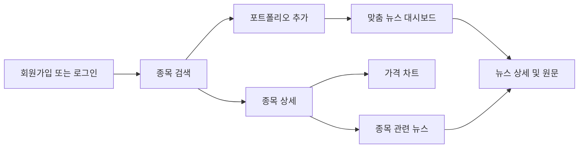

# InvestLens 서비스 소개

## 1. 서비스 개요

InvestLens는 관심 종목과 관련된 뉴스를 한곳에 모으고, 뉴스가 기업에 미칠 수 있는 영향을 빠르게 파악하도록 돕는 금융 정보 서비스입니다.

사용자는 한국·미국 시장의 주식과 ETF를 검색해 포트폴리오에 등록할 수 있습니다. 등록한 종목을 기준으로 맞춤 뉴스 피드를 확인하고, 각 뉴스의 영향 방향과 영향도를 함께 살펴볼 수 있습니다. 종목 상세 화면에서는 가격 흐름과 거래량, 관련 뉴스를 하나의 흐름으로 제공합니다.

> InvestLens의 뉴스 분석은 투자 참고 정보이며 투자 조언이나 주가 예측이 아닙니다.

## 2. 해결하려는 문제

투자자는 여러 매체에서 쏟아지는 기사 중 자신이 보유하거나 관심 있는 종목과 관련된 내용을 직접 선별해야 합니다. 기사 제목만으로는 해당 소식이 기업에 어떤 의미가 있는지 판단하기 어려우며, 종목 검색·시세 확인·뉴스 탐색을 서로 다른 서비스에서 반복하게 되는 경우도 많습니다.

InvestLens는 다음 과정을 하나의 서비스 안에서 연결합니다.

1. 한국·미국 주식 및 ETF 검색
2. 관심 종목 포트폴리오 구성
3. 포트폴리오 기반 맞춤 뉴스 확인
4. 뉴스별 영향 방향과 영향도 확인
5. 종목 가격 차트와 관련 뉴스 교차 확인
6. 원문 기사로 이동해 상세 내용 검증

## 3. 핵심 기능

### 회원가입과 로그인

- 이메일과 비밀번호를 이용한 회원가입 및 로그인
- JWT Access Token 기반 인증
- 인증 만료 시 안전하게 세션을 정리하고 로그인 화면으로 이동

### 종목 통합 검색

- 한국 시장과 미국 시장 지원
- 주식과 ETF 지원
- 티커 또는 종목명 검색
- 시장·종목 유형 필터
- 정확히 일치하는 티커 강조
- 검색 결과에서 상세 조회 또는 포트폴리오 추가
- 키보드 방향키와 Enter를 이용한 결과 탐색 및 추가

### 포트폴리오

- 관심 종목 등록 및 삭제
- 종목 상세 화면과 포트폴리오 화면에서 일관된 관리 경험 제공
- 포트폴리오를 맞춤 뉴스의 기준으로 사용

### 맞춤 뉴스 피드

- 포트폴리오 종목을 기준으로 개인화된 뉴스 제공
- 긍정·중립·부정 방향 필터
- 최소 영향 점수 필터
- 언론사, 발행 시각, 요약, 관련 종목과 평가 이유 표시
- 뉴스 상세 화면과 원문 기사 링크 제공

### 종목 상세

- 종목 로고, 기업명, 티커, 시장 및 유형 정보
- 현재가, 전일 종가, 등락 금액과 등락률
- 1일·1주·1개월·3개월·1년·5년 가격 차트
- 가격 흐름과 거래량을 함께 표시
- 해당 종목의 관련 뉴스와 다국어 조회
- 관련 뉴스 영역으로 빠르게 이동하는 스크롤 인터랙션

### 다국어 관련 뉴스

- 한국어, 영어, 일본어, 중국어 지원
- 번역된 제목과 요약 우선 표시
- 번역을 사용할 수 없으면 원문 제목과 명확한 안내 표시
- 원문 링크를 새 창에서 안전하게 열기

## 4. 뉴스 영향 정보 읽는 방법

### 영향 방향

| 방향 | 의미 |
|---|---|
| 긍정 | 기사 내용이 기업의 사업, 수요, 실적 등에 긍정적인 영향을 줄 가능성 |
| 중립 | 직접적인 영향이 없거나 긍정·부정 요소가 혼재된 상태 |
| 부정 | 기사 내용이 기업의 사업, 비용, 규제, 실적 등에 부정적인 영향을 줄 가능성 |

방향은 색상만으로 구분하지 않고 아이콘과 텍스트를 함께 사용해 접근성을 높였습니다.

### 영향 점수

| 점수 | 기준 |
|---:|---|
| 1점 | 단순 언급 또는 영향이 거의 없음 |
| 2점 | 간접적이고 제한적인 영향 |
| 3점 | 사업·수요·비용·규제에 의미 있는 영향 |
| 4점 | 실적이나 핵심 사업에 직접적인 큰 영향 |
| 5점 | 기업 전체에 즉각적이고 중대한 영향 |

점수는 호재·악재의 강도를 뜻하는 값이 아니라, 해당 뉴스가 기업에 미칠 수 있는 **영향의 중요도**를 나타냅니다. 예를 들어 중립 1점은 종목이 기사에서 단순히 언급되었거나 실제 영향이 거의 없다는 의미입니다.

### AI 분석 상태

- `AI 분석 완료`: 실제 기사 분석 결과에 한해 방향, 점수, 이유를 표시합니다.
- `AI 분석 준비 중`: AI 호출 실패, 비활성화 또는 분석 전 상태입니다. 이 경우 fallback 값을 실제 AI 평가처럼 노출하지 않습니다.

## 5. 사용자 흐름

## 6. 화면 설계 원칙

- 금융 서비스에 어울리는 절제된 초록·파랑 계열 색상
- 14px 중심의 조밀한 데스크톱 대시보드
- 8px, 12px, 16px 기반의 일관된 간격 체계
- 얇은 테두리, 은은한 그림자, 통일된 카드 radius
- 모바일에서 자연스럽게 한 열로 전환되는 반응형 구조
- 라이트 모드와 다크 모드 지원
- 키보드 포커스, 스크린 리더 레이블, 색상 외 상태 표현 지원
- 로딩·오류·빈 데이터 상태에서도 동일한 디자인 언어 유지

## 7. 데이터 및 출처 정책

- 종목, 시세, 뉴스 데이터는 InvestLens 백엔드만 호출합니다.
- 프론트엔드에서 거래소, 포털 또는 외부 시세 제공처를 직접 호출하지 않습니다.
- 종목 로고 URL은 백엔드 응답의 `logoUrl`을 그대로 사용합니다.
- 로고가 없거나 로드에 실패하면 종목명 또는 티커 기반 모노그램을 표시합니다.
- Logo.dev 로고가 사용되는 화면에는 제공된 출처 링크를 유지합니다.
